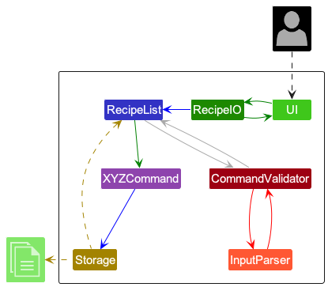
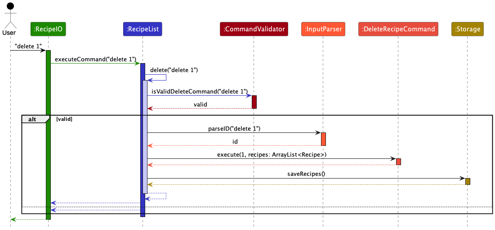
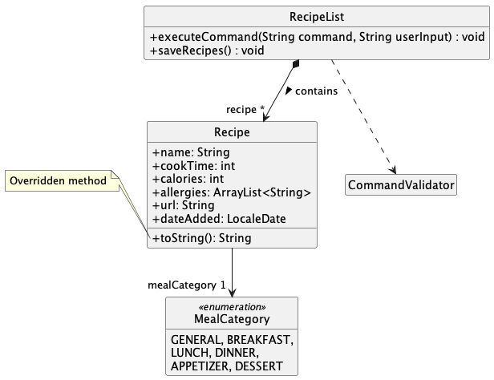

# Developer Guide

## Acknowledgements

* This application is built in fulfillment of the requirements of CS2113.
* Knowledge and ideas are adapted from the CS2113 textbook, as well as SE-EDU textbook.

---

# Table of Contents

1. [Setting up, getting started](#setting-up-getting-started)
2. [Design & Implementation](#design--implementation)
   1. [Architecture](#architecture)
   2. [UI Component](#ui-component)
   3. [RecipeList Component](#recipelist-component)
3. [Appendix - Requirements](#appendix-requirements)
4. [Appendix - Commands Glossary](#appendix-commands-glossary)
5. [Appendix - Manual Testing](#appendix-instructions-for-manual-testing)
6. [Appendix - Area of Improvement](#appendix-area-of-improvement)

---

## Setting up, getting started

Refer to the User guide at https://ay2324s2-cs2113-w14-2.github.io/tp/UserGuide.html for how to get started with RecipeIO.

---

## Design & implementation

### Architecture

The ***Architecture Diagram*** given above explains the high-level design of the application.

Given below is a quick overview of main components and how they interact with each other.

**Main components of the architecture**

**`RecipeIO`**  is in charge of the app launch and shut down.
* At app launch, it initializes the other components in the correct sequence, and connects them up with each other.
* At shut down, it shuts down the other components and invokes cleanup methods where necessary.

The bulk of the app's work is done by the following five components:

* `UI` The UI of the App.
* `RecipeList`: The command executor and holder of data of the app.
* `InputParser`: Extracts information from the user input into the command line.
* `CommandValidator`: The command validator.
* `Storage`: Reads data from, and writes data to, the hard disk.

The `commands`package represents a collection of commands used by **`RecipeList`**.

**How the architecture components interact with each other**

The *Sequence Diagram* below shows how the components interact with each other for the scenario where the user issues the command `delete 1`.

### UI Component

The **API** of this component is specified in [UI.java](https://github.com/AY2324S2-CS2113-W14-2/tp/blob/master/src/main/java/recipeio/ui/UI.java)

The `UI` has an class-level attribute `SEPARATOR`, which is a line of dashes that can be used in console output.

The `UI` the following methods
* `getUserInput` : asks the user for an input through the command line.
* `sayHi` (class-level): greets the user.
* `printInstructions` (class-level) : prints a list of accepted commands.
* `printInvalidCommandWarning` (class-level) : warns the user of an invalid command.
* `bye` (class-level) : bids farewell to the user.

How the component works:

* Upon starting of the app, `RecipeIO` will create an instance of the `UI` class.
* The instance will be asking the user for his or her input, via the `getUserInput` method.
* During the execution of the app, it will also give the user some console feedback.
  * For example, the `printInstructions` method is called when the user inputs `help`.

### RecipeList Component

The **API** of this component is specified in [RecipeList.java](https://github.com/AY2324S2-CS2113-W14-2/tp/blob/master/src/main/java/recipeio/recipe/RecipeList.java)

The `RecipeList` contains many `Recipe`s, which has attributes:
* `name` : String
* `cookTime` : int
* `calories` : int
* `allergies` : ArrayList<String>
* `mealCategory` : MealCategory
* `url` : String
* `dateAdded` : LocaleDate

How the component works:

* Upon `executeCommand` call, the `RecipeList` will identify the command given in the user input (e.g. `list`), 
* It will then call the corresponding `list()` method defined in `RecipeList`. 
* This `list()` method in turn calls the `ListRecipeCommand.execute()` command. 
* The reason for such a structure is to allow for command validation *before* the real execution. A good example is the `find()` command. 
* Thus, `RecipeList` contains an intermediate method for each functionality (add, find, delete, so on) , and serves as a command validator.
  * **Note:** these methods have been omitted in the class diagram for brevity.
* In `add()` and `delete()`, the `saveRecipes()` method is called to save the recipeBook after the modification.

---

## Appendix: Requirements

## Product scope

### Target user profile
Recipe.io is designed to cater to a diverse range of users who share a common need to manage and access a significant number of recipes effectively. Here are key characteristics of our target users:

* <h4>Culinary Professionals:</h4> Chefs, culinary students, and other professionals in the food industry who need to store, organize, and access a wide variety of recipes for their culinary creations.

* <h4>Home Chefs and Cooking Enthusiasts:</h4> Individuals who enjoy cooking and experimenting with new recipes at home and wish to expand their culinary repertoire. They appreciate a tool that helps them organize and revisit their favorite recipes.

* <h4>Fast Typers:</h4> Users who are proficient with keyboard use and prefer typing over mouse interactions, making them ideal users of a CLI-based application. They value the efficiency and speed that CLI programs offer.

* <h4>Individuals with Dietary Restrictions:</h4> Users who need to manage dietary restrictions due to health reasons, allergies, or personal choices. They benefit from the ability to filter and search recipes based on specific ingredients or allergens.

* <h4>Tech-Savvy Recipe Collectors:</h4> Users who frequently collect recipes from various online sources and prefer a digital solution to manage and categorize these recipes easily. They require a tool that allows quick access and efficient management of a digital recipe collection.

* <h4>Educational Users:</h4> Cooking instructors and students who use recipes as a teaching and learning tool in culinary courses. They need to access and provide recipes easily during classes and practical sessions.

* <h4> Meal Planners and Preppers: </h4> Individuals who plan meals for the week or month and need to organize recipes based on meal types, ingredients, or nutritional information to streamline their meal preparation process.

### Value proposition

* The user will be able to add, access, and list recipes.
* He can also filter recipes based on allergies (i.e. excluding a certain ingredient)
* The saved recipes will be loaded in a recipe text file for easy access and sharing with friends.
* The user can put the recipes into different meal categories. 
* The user can view his recipes in different sorted orders.
* The user can easily access details of a particular recipe.

## User Stories

| Version | As a ... | I want to ...                             | So that I can ...                                                |
|---------|----------|-------------------------------------------|------------------------------------------------------------------|
| v1.0    | new user | see usage instructions                    | refer to them when I forget how to use the application           |
| v1.0    | user     | add a recipe                              | curate my own unique recipes for future use                      |
| v1.0    | user     | delete a recipe                           | remove any outdated or unimportant recipes                       |
| v1.0    | user     | view all of my recipes                    | access my recipes and see how many I have easily                 |
| v2.0    | user     | find a recipe by name                     | locate a recipe without having to go through the entire list     |
| v2.0    | foodie   | save and load recipes                     | share recipes with friends conveniently                          |
| v2.0    | user     | find recipes without a certain ingredient | save time finding recipes that I can eat (leave out allergies)   |
| v2.0    | user     | view details of a particular recipe       | learn more about the recipe that I may have forgotten            |
| v2.0    | user     | find a recipe by date                     | find a recipe from a particular day if I don't remember its name |
| v2.1    | user     | see my recipe list in a certain way       | make decisions quicker                                           |
| v2.1    | user     | find a recipe by url                      | access recipes from a certain website easily                     |

### Use cases

(For all use cases below, the **System** is the `RecipeIO` and the **Actor** is the `user`, unless specified otherwise)

**Use case: Delete a recipe**

1.  User requests to list recipes
2.  RecipeIO shows a list of recipes
3.  User requests to delete a specific recipe in the list
4.  RecipeIO deletes the recipe and confirms the deletion to the user.

Use case ends.

**Use case: Add a recipe**

1.  User provides details for a new recipe using the `add` command format.
2.  RecipeIO validates the input data.
3.  If the data is valid, RecipeIO stores the new recipe and confirms the addition to the user.
4.  If the data is invalid, RecipeIO informs the user about the validation errors and requests correct data.

Use case ends.

**Use case: Find recipes by keyword**

1.  User inputs a keyword using the `find kw [KEYWORD]` command.
2.  RecipeIO searches for recipes containing the keyword in their names / descriptions.
3.  RecipeIO displays the list of matching recipes.
4.  If no recipes match, RecipeIO informs the user that no recipes were found.

Use case ends.

**Use case: Find recipes by date**

1.  User inputs a date using the `find date [YYYY-MM-DD]` command.
2.  RecipeIO searches for recipes added on the specified date.
3.  RecipeIO displays the list of recipes added on that date.
4.  If no recipes match the specified date, RecipeIO informs the user that no recipes were added on that date.

Use case ends.

**Use case: Find recipes by URL**

1.  User inputs a URL using the `find url [URL]` command.
2.  RecipeIO searches for recipes that include the specified URL or match parts of the URL in their stored URL data.
3.  RecipeIO displays the list of recipes that match the URL criteria.
4.  If no recipes match the specified URL, RecipeIO informs the user that no recipes were found with that URL.

Use case ends.

**Use case: Find recipes by meal category**

1.  User inputs a meal category using the `find meal [MEAL_CATEGORY]` command.
2.  RecipeIO searches for recipes that are part of the specified meal category. 
3.  RecipeIO displays the list of recipes that match the URL criteria.
4.  If no recipes match the specified meal category, RecipeIO informs the user that no recipes were found with that URL.

Use case ends.

**Use case: Filter recipes by allergy**

1.  User specifies an allergy using the `filter [ALLERGY]` command.
2.  RecipeIO filters the recipes to exclude any that contain the specified allergy.
3.  RecipeIO displays the list of filtered recipes.
4.  If all recipes contain the allergy, RecipeIO informs the user that no suitable recipes were found.

Use case ends.

**Use case: List all recipes**

1.  User requests to view all recipes using the `list` command.
2.  RecipeIO retrieves all recipes from storage.
3.  RecipeIO displays the recipes in the order they were added or sorted according to any specified criteria.
4.  If no recipes exist, RecipeIO informs the user that the recipe book is empty.

Use case ends.

**Use case: Exit the application**

1.  User issues the `exit` command to close the application.
2.  RecipeIO saves any changes made during the session.
3.  RecipeIO closes the application and confirms closure to the user.

Use case ends.

## Non-Functional Requirements

1. Should work on any _mainstream OS_ as long as it has Java `11` or above installed.

---

## Appendix: Commands Glossary

Note: `[]` denote mandatory parameters, while `{}` denote optional paramters. 
* *add [NAME, MINUTES, KCALS, ALLERGIES, CATEGORY, URL]* - This is the command a user can call to add a recipe. 
* *help* - This shows the user all the available commands. 
* *list {SORT_TYPE}* - This lists out a users recipebook for them. 
* *delete* - This deletes a recipe at a given valid index. If not valid, it will return an error message.
* *find kw [KEYWORD]* - This finds recipes with a user-given keyword.
* *find date [YYYY-MM-DD]* - This finds recipes added on a user-given date. The date is auto-added when adding. 
* *find allergy [KEYWORD]* - This finds recipes without a certain ingredient.
* *exit* - This is the command to leave the program.
---

## **Appendix: Instructions for manual testing**

Given below are instructions to test the app manually.

**Note:** These instructions only provide a starting point for testers to work on;
testers are expected to do more *exploratory* testing.

{Give instructions on how to do a manual product testing e.g., how to load sample data to be used for testing}

### Adding a Recipe

1. **Test case**: `add pizza, 34, 340, egg/nut/dairy/red meat, dinner, www.food.com`
   * **Expected**: The specified recipe is successfully added to the recipe list.
   * **Console output**: Displays a brief description of the added recipe along with the total number of recipes in the list.

2. **Test case**: `add pizza, 34, 340, egg/nut/dairy/red meat, dinner`
   * **Expected**: The recipe is not added due to a missing required parameter.
   * **Console output**: Prompts the user to provide all 6 required parameters.

3. **Test case**: `add pizza, abc, def, egg/nut/dairy/red meat, dinner, www.food.com`
   * **Expected**: The recipe is not added because the input types for cook time and calories are incorrect.
   * **Console output**: Informs the user that integers are required for cook time and calorie fields.

4. **Test case**: `add pizza, 34, 340, egg/nut/dairy/red meat, capybara, www.food.com`
   * **Expected**: The recipe is not added due to an unrecognized meal category.
   * **Console output**: Requests the user to select a valid meal category from the provided options: breakfast, lunch, dinner, appetizer, and dessert.

5. **Test case**: `add pizza, 34, 340, egg/nut/dairy/red meat, lunch, food.com`
   * **Expected**: The recipe is not added because the URL lacks the required protocol.
   * **Console output**: Urges the user to include a proper protocol in the URL with examples.

6. **Test case**: `add pizza, 34, 340, egg/nut/dairy/red meat, lunch, www.food`
   * **Expected**: The recipe is not added due to an invalid domain or top-level domain in the URL.
   * **Console output**: Advises the user to use valid domain names with examples.

7. **Test case**: `add pizza 34, 340, egg/nut/dairy/red meat, lunch, www.food`
   * **Expected**: The recipe is not added because a comma is missing, leading to incorrect parameter parsing.
   * **Console output**: Alerts the user to provide all 6 parameters correctly and suggests checking for missing commas.

### Deleting a Recipe

**Prerequisites**: Ensure that multiple recipes are listed using the `list` command.

1. **Test case**: `delete 1`
   * **Expected**: The first recipe in the list is successfully deleted.
   * **Console output**: Confirms which recipe was deleted with a brief description.

2. **Test case**: `delete 0`
   * **Expected**: No recipe is deleted because the index provided is out of bounds.
   * **Console output**: Reminds the user to enter a number within the range of existing recipe numbers.

3. **Test case**: `delete xyz`
   * **Expected**: No recipe is deleted as the input is not an integer.
   * **Console output**: Instructs the user to input an integer value.

4. **Test case**: `delete`
   * **Expected**: No recipe is deleted as no index is provided.
   * **Console output**: Directs the user to provide an index for the delete command.

### Show the recipe list
**Prerequisites**: List all recipes using the `list` command. Multiple recipes in the list.

1. **Test case**: `list sortname sortdate`
   * **Expected**: The recipe list is not shown due to having extra details aside from `SORT_TYPE`
   * *Console output*: Reports that there are redundant details for the command

2. **Test case**: `list srt`
   * **Expected**: The recipe list is not shown due to the incorrect `SORT_TYPE`.
   * *Console output*: Reports that `SORT_TYPE` is incorrect.
   * *Console output*: Also display available options for `SORT_TYPE` to the user.

3. **Test case**: `list sortname`
   * **Expected**: The recipes in recipe list are sorted according to their name.
   * *Console output*: Display list of recipes organised according to their recipe name in alphabetical order.

4. **Test case**: `list sortdate`
   * **Expected**: The recipes in recipe list are sorted according to the date they were added.
   * *Console output*: Display list of recipes organised according to the date they were added from earliest to latest.

5. **Test case**: `list sortcooktime`
   * **Expected**: The recipe list is sorted according to their cook time.
   * *Console output*: Display list of recipes organised according to their cooking time from the shortest.

6. **Test case**: `list sortcalories`
   * **Expected**: The recipe list is sorted according to their calories.
   * *Console output*: Display list of recipes organised according to their calories from the lowest.

### Finding a Recipe by Keyword

**Prerequisites**: Ensure that multiple recipes are listed, including at least one with "soup" in the recipe name.

1. **Test case**: `find kw soup`
   * **Expected**: Recipes containing the word "soup" in their names are found and listed.
   * **Console output**: Shows which recipes include the keyword "soup".

2. **Test case**: `find kw sou`
   * **Expected**: No matching recipe is found as the keyword does not exactly match any recipe names.
   * **Console output**: Suggests the user try another keyword or check the existing recipe names for exact matches.

3. **Test case**: `find kw`
   * **Expected**: No recipe is found due to the absence of a keyword.
   * **Console output**: Prompts the user to ensure two arguments are entered for the find command.

4. **Test case**: `find kw 1`
   * **Expected**: No recipe matches because the keyword is not alphabetical.
   * **Console output**: Reminds the user that the keyword should consist of alphabets only.

### Finding a Recipe by Date

**Prerequisites**: List all recipes, ensuring at least one has a date of `2024-03-30` and none on `2024-01-03`.

1. **Test case**: `find date 2024-03-30`
   * **Expected**: Recipes added on `2024-03-30` are successfully found and listed.
   * **Console output**: Displays the recipes added on the specified date.

2. **Test case**: `find date 2024-01-03`
   * **Expected**: No recipes are found as no recipes were added on that date, despite the date being valid.
   * **Console output**: Reports that no recipes were added on `2024-01-03`.

3. **Test case**: `find date xyx`
   * **Expected**: No recipe is found because the input does not conform to a valid date format.
   * **Console output**: Notifies the user that the date is not valid and suggests using the `YYYY-MM-DD` format.

4. **Test case**: `find date`
   * **Expected**: No recipe is found due to the lack of a specified date.
   * **Console output**: Asks the user to ensure that two arguments are entered for the find command.
<<<<<<< HEAD

=======
>>>>>>> 1d17de443d021f1b3f2f1654cb07f4f786f967d4

### Finding a recipe by url

**Prerequisites**: List all recipes using the `list` command. Multiple recipes in the list.
   At least one recipe with url of `www.food.com/fish` but none with url of `www.food.net`.

1. **Test case**: `find url www.food.com`
   * **Expected**: Matching recipes containing valid urls are given, including `www.food.com/fish`
   * *Console output*: Shows the user which recipes match the url of `www.food.com`
   
2. **Test case**: `find url`
   * **Expected**: No recipe is found due to the lack of a given url.
   * *Console output*: Asks the user to check that he or she inputted two arguments to the find method.

3. **Test case**: `find url 123`
   * **Expected**: No recipe is found due to an invalid url subdomain.
   * *Console output*: Reports to the user that a valid subdomain must be given, with valid url examples given.

4. **Test case**: `find url food.com`
   * **Expected**: No recipe is found due to an invalid url subdomain.
   * *Console output*: Reports to the user that a valid subdomain must be given, with valid url examples given.

5. **Test case**: `find url www.food`
   * **Expected**: No recipe is found due to an invalid url domain.
   * *Console output*: Reports to the user that a valid domain or TLD must be given, with valid url examples given.

6. **Test case**: `find url www.food.net`
   * **Expected**: No matching recipes are found despite a valid url given.
   * *Console output*: Reports that no recipes matches `www.food.net` as a
     valid url is given without any matching recipes.

7. **Test case**: `find url www.food.com/fish`
   * **Expected**: Recipes matching the whole url including path will be matched, thus excluding `www.food.com` recipes
   * *Console output*: Shows the user which recipes match the url of `www.food.com/fish`

### Finding a recipe by meal category

**Prerequisites**: List all recipes using the `list` command. There is at least one recipe in the `BREAKFAST` meal category, and none in the `DINNER` meal category.

1. **Test case**: `find meal BREAKFAST`
   * **Expected**: Recipes categorized under BREAKFAST are displayed.
   * **Console output**: Shows the user which recipes are categorized as BREAKFAST.

2. **Test case**: `find meal`
   * **Expected**: No recipe is found due to the lack of a specified meal category.
   * **Console output**: Asks the user to check that he or she inputted two arguments to the find method.

3. **Test case**: `find meal breakfast`
   * **Expected**: Recipes categorized under BREAKFAST are displayed, showcasing case-insensitivity in category handling.
   * **Console output**: Shows the user which recipes are categorized as BREAKFAST.

4. **Test case**: `find meal snack`
   * **Expected**: No recipe is found as "snack" is not a valid meal category.
   * **Console output**: Informs the user that "snack" is not a recognized meal category and displays valid options: GENERAL, BREAKFAST, LUNCH, DINNER, APPETIZER, DESSERT.

5. **Test case**: `find meal DINNER`
   * **Expected**: No recipe is found as there are no recipes with `DINNER` as a meal category.
   * **Console output**: SInforms the user that there were no matches with the given meal category `DINNER`.
---

## Appendix: Area of Improvement

1. **Having the CommandValidator return the parsed input, if the command is valid.**
   * `CommandValidator` evaluates the inputs from the user, but only returns a boolean value of whether the command is valid.
   * If the command is valid, there is an additional call to `InputParser` to get the inputs again.
   * **Recommendation**: The `CommandValidator` could return the input together if the command is valid, and `null` otherwise.
2. **Enabling `find` and `filter` with various inputs**
   * Currently, the find and filter only take in one searchable input. Expanding that to include multiple (eg `filter egg dairy`) could increase the potential use case of the app. 
